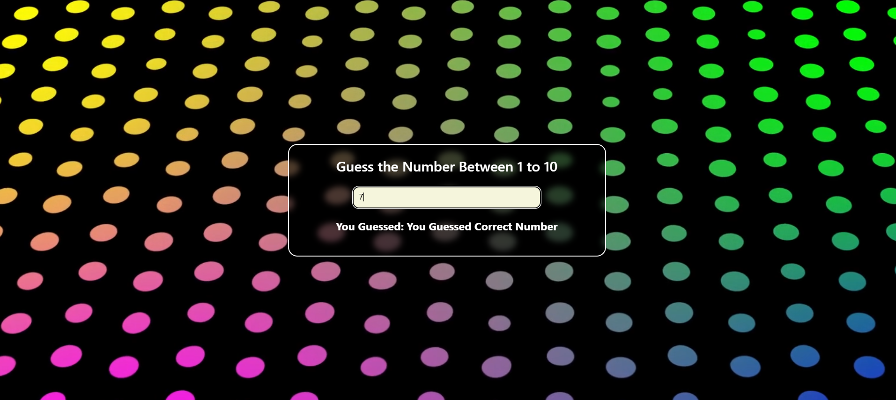

# Number Guess Game React

Interactive number‐guessing game built with React, showcasing hooks and state management against an immersive full‐screen video background.



## 🔧 Features

- Guess a number between 1 and 10 with instant feedback  
- Built with React functional components and hooks  
- Immersive full‐screen video background  
- Responsive design for desktop and mobile

## 🚀 Installation

1. **Clone the repo**  
   ```bash
   git clone https://github.com/vigneshpraveen-official/number-guess-game-react.git
   ```
2. **Navigate into the project folder**
    ```bash
    cd number-guess-game-react
    ```
3. **Install dependencies**
   ```bash
    npm install
    ```
4. **Start the development server**
   ```bash
    npm start
    ```

## 🗂️ File Structure
  ```css
      public/
      ├─ guess-game-video.mp4
      ├─ guess-number-react.png
      src/
      ├─ App.js
      ├─ App.css
      ├─ Result.js

  ```

## 🏗️ Usage
1. Open your browser at http://localhost:3000

2. Enter your guess in the input field

3. See instant feedback—correct or try again!

4. Refresh to generate a new random number
   
